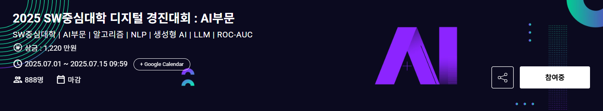

# 2025 SW중심대학 디지털 경진대회 : AI부문 


## 생성형 AI(LLM)와 인간 : 텍스트 판별 챌린지 (Private 13th) 🏆


### Reproduce
0. Get a GPU with 24GB of VRAM or more.
1. Download data in [Dacon](https://dacon.io/competitions/official/236473/data). Data should be include train.csv, test.csv, sample_submission.csv to run full code in this repository.
2. Create python 3.11 environment and run `pip install -r "requirements.txt"`
3. Run `pre-processing.ipynb`, you can get `train_undersampled.csv` .
4. Run 
``` python
python train/roberta-large.py && train/deberta-v3-xlarge-korean-192.py && train/deberta-v3-xlarge-korean.py && train/deberta-v3-base-korean.py && train/koelectra-base-v3-discriminaotr.py && train/mdeberta-v3-base-kor-further.py
```
5. Run `inference.py`

### Ciatation
```
@misc{park2021klue,
      title={KLUE: Korean Language Understanding Evaluation},
      author={Sungjoon Park and Jihyung Moon and Sungdong Kim and Won Ik Cho and Jiyoon Han and Jangwon Park and Chisung Song and Junseong Kim and Yongsook Song and Taehwan Oh and Joohong Lee and Juhyun Oh and Sungwon Lyu and Younghoon Jeong and Inkwon Lee and Sangwoo Seo and Dongjun Lee and Hyunwoo Kim and Myeonghwa Lee and Seongbo Jang and Seungwon Do and Sunkyoung Kim and Kyungtae Lim and Jongwon Lee and Kyumin Park and Jamin Shin and Seonghyun Kim and Lucy Park and Alice Oh and Jungwoo Ha and Kyunghyun Cho},
      year={2021},
      eprint={2105.09680},
      archivePrefix={arXiv},
      primaryClass={cs.CL}
}
```

```
@misc{park2020koelectra,
  author = {Park, Jangwon},
  title = {KoELECTRA: Pretrained ELECTRA Model for Korean},
  year = {2020},
  publisher = {GitHub},
  journal = {GitHub repository},
  howpublished = {\url{https://github.com/monologg/KoELECTRA}}
}
```

```
@misc{he2021debertav3,
      title={DeBERTaV3: Improving DeBERTa using ELECTRA-Style Pre-Training with Gradient-Disentangled Embedding Sharing}, 
      author={Pengcheng He and Jianfeng Gao and Weizhu Chen},
      year={2021},
      eprint={2111.09543},
      archivePrefix={arXiv},
      primaryClass={cs.CL}
}
```


